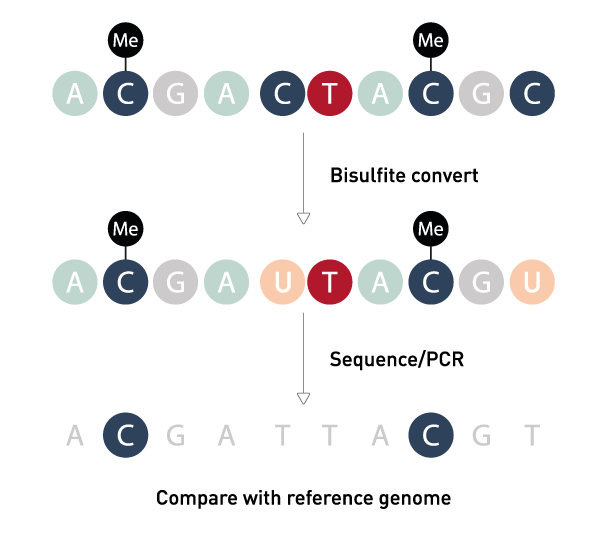
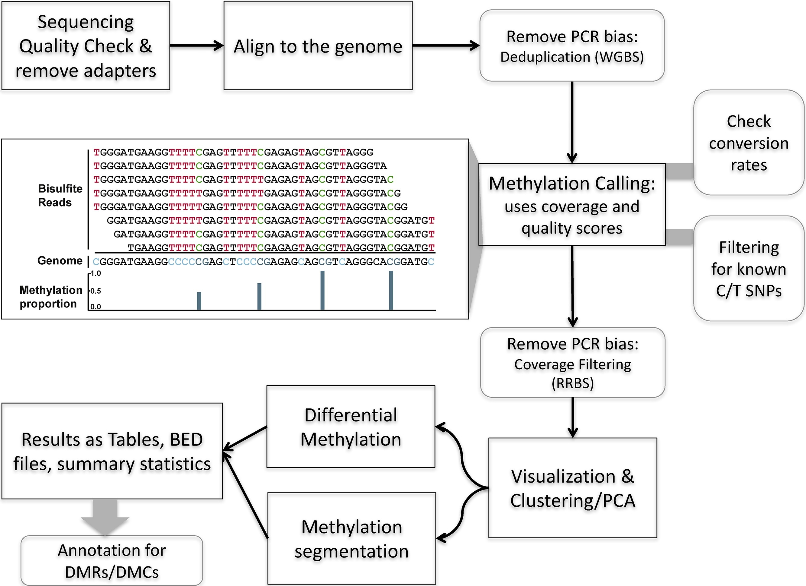
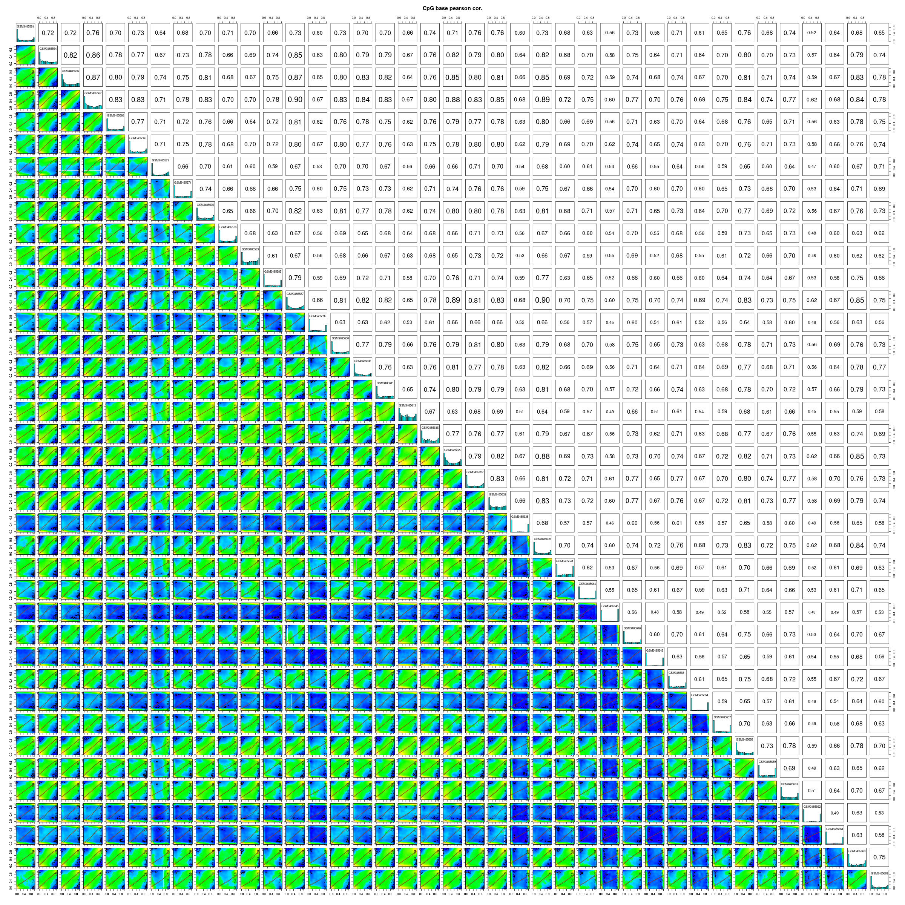

# Введение

Метилирование ДНК играет важную роль в регуляции экспрессии генов млекопитающих. Метилирование промотора, как правило, инактивирует экспрессию группы рядом расположенных генов, так как транскрипционные факторы не могут связаться с промотором вследствие как прямого стереохимического влияния метильной группы, так и изменения пространственной структуры хроматина. ДНК метилируется по остаткам цитозина по атому углерода в 5 положении с помощью специальных ферментов ДНК-метилтрансфераз. Цитозины метилируются в большинстве своём в специальных областях, богатыми CG-динуклеотидами. Такие области называют CpG-островки.

Исследование метилирования генов в онкологии помогает понять природу изменений в опухолевой ткани, выделить подтипы опухолей в соответствии с которыми можно подбирать терапевтические агенты. Методов, измеряющих метилирование ДНК, изобретено большое количество. В этом мастер-классе мы поговорим о бисульфитном секвенировании с уменьшенной представленностью (Reduced Representation Bisulfite Sequencing, RRBS).

***Внимание**:* методы и подходы, рассказываемые в этом блокноте также применимы к полногеномному бисульфитному секвенированию (Whole Genome Bisulfite Sequencing, WGBS). Данный блокнот не претендует на истину в последней инстанции. Существуют альтернативные подходы к анализу и соответствующие программы и библиотеки.

# RRBS

RRBS - бисульфитное секвенирование с уменьшенной представленностью. Оно более дешевое, чем секвенирование полного генома, но даёт информацию более, чем о 80% CpG островках человеческого генома. Достигается этот эффект за счёт обогащения библиотеки специальными рестриктазами (MspI, XmaI).

Библиотеки в процессе подготовки к секвенированию подвергают бисульфитной конверсии, т.е. обрабатывают раствором NaHSO~3~ . Суть этого шага, представлена на рисунке \@ref(fig:bisulfite). Неметилированные цитозины при обработке бисульфитом натрия окисляются до урацила, который при ПЦР заменяется на тимин. Однако такому не подвержены метилированные цитозины. Следовательно, на том месте, где секвенатором получен тимин, был неметилированный цитозин, а процитанные цитозины - метилированные. Таким образом, можно измерять уровень метилирования в конкретном локусе ДНК с разрешением до отдельных нуклеотидов.

```{r bisulfite, echo=FALSE, fig.cap="Бисульфитная конверсия"}

```

Уровень метилирования рассчитывается по следующей формуле:

$$
methylation = \frac{C}{C+T}
$$

# Анализ данных

## Используемые программы

Этот раздел описывает используемые программы, в рамках практики мы не будем их использовать, а воспользуемся уже предобработанными данными. Перечисленные программы являются консольными, скомпилированными для операционных систем на базе ядра Linux. Работа с этими операционными системами требует дополнительной подготовки и выходит за рамки нашего мастер-класса.

Последовательность обработки данных представлена рисунке \@ref(fig:workflow) [@wreczycka2017].

```{r workflow, echo=FALSE, fig.cap="Конвейер анализа данных RRBS"}

```

Контроль качества осуществляется с помощью стандартной программы *FastQC*. Процессинг fastq файлов можно осущствлять любой программой, например, *Trimmomatic*. *TrimGalore* специальная программа-триммер для данных RRBS. Выравнивание на геном осуществляется с помощью программы *bismark*, которая для своей работы использует программу *bowtie2.* При выравнивании результатов необходимо знать, каким прибором были получены результаты и какого типа выравниваемая библиотека. Если ваша библиотека отсеквенирована с помощью Ion Torrent, то необходимо использовать пониженные штрафы за открытие (gap openning) и продолжение (gap extension) пропуска [@tanas2017]. Библиотеки для RRBS бывают двух типов - направленные (directional) и ненаправленные (non-directional). Направленные библиотеки содержат прочтения только оригинальных цепей (OT - original top, OB - original bottom), ненаправленная ещё содержит прочтения комплементарные оригинальным (CTOT - complemetary to OT, CTOB - complementary to OB). Ниже приведен пример кода для запуска описанных выше программ.

```{bash eval = F}
fastqc -o QC/preprocessing -t 5 raw_reads/* 2>&1 | tee -a $ID.log

READY_FORWARD="${ID}_R1.fastq.gz"
READY_REVERSE="${ID}_R2.fastq.gz"

fastp --in1 raw_reads/$FORWARD_NAME --in2 raw_reads/$REVERSE_NAME --out1 processed_reads/$READY_FORWARD --out2 processed_reads/$READY_REVERSE -z 9 --adapter_fasta $ADAPTERS --detect_adapter_for_pe  --trim_poly_g --cut_tail 26 --cut_front 26 --cut_right 26 --cut_window_size 4 --n_base_limit 0 --length_limit 260 --length_required 100 --html "QC/fastp/fastp_report.html" --json "QC/fastp/fastp_report.json" --thread 5 2>&1 | tee -a $ID.log

fastqc -o QC/postprocessing -t 5 processed_reads/* | tee -a $ID.log

bismark --non_directional --bowtie2 -L 24 -score_min "L,-0.6,-0.6" --gzip --bam --temp_dir tmp -output_dir tmp --basename ${ID}_bismark_bt2 -q $REFERENCE -1 processed_reads/$READY_FORWARD -2 processed_reads/$READY_REVERSE 2>&1 | tee -a $ID.log

```

Удаление дупликатов осуществляется с помощью программы *picard*, methylation calling также с помощью *bismark* (*bismark_methylation_extractor*). Для работы с bam файлами потребуется программа *samtools.* Для поиска вариантов на конвертированнх библиотеках есть программа *BS-Snper*.

## Обработка результатов с помощью R

После того, как мы получили, процессированные с помощью перечисленных выше программ, файлы, дальнейшую обработку результатов удобно проводить с помощью языка программирования R, так как он содержит экосистему пакетов, специализрованных на анализе данных биологических экспериментов. В качестве примера, связанного с онкологией, мы вызьмем работу моих коллег по раку молочной железы [@tanas2019]. Данные по этой статье выложены в базы данных SRA и GEO (GSE122799). Данный мастер-класс подготовлен на основе [этого учебника](https://compgenomr.github.io/book/) [@akalin].

### Подготовка к работе

Перед началом работы нам необходимо установить пакеты для языка R. Пакеты общего назначения устанавливаются c помощью функции install.packages из репозитория CRAN. Специализированные пакеты устанавливаются из репозитория Bioconductor. Вызовы функции я буду стараться оформлять в полном виде, т.е. имя-пакета::имя-функции, что далеко не всегда обязательно. Делаю я это для того, чтобы было понятно, какому пакету, принадлежит эта функция.

```{r eval=F}
if (!require("BiocManager", quietly = TRUE))
    install.packages("BiocManager") # для установки пакетов из Bioconductor

install.packages(c("doParallel","plyr","stringr", "ggplot2"))
BiocManager::install(c("GEOquery","methylKit","genomation","org.Hs.eg.db","pheatmap","Rgraphviz","clusterProfiler"))
```

### Импорт пакетов

```{r echo=T, include=FALSE}
# Это комментарий
library(GEOquery) # для извлечения данных из Gene Expression Omnibus.
library(methylKit) # для работы с данными метилирования.
library(doParallel) # ускорение тяжелых вычислений
library(plyr) # для работы с таблицами
library(stringr) # для работы с строками
library(genomation) # для аннотирования результатов
library(clusterProfiler) # для анализа перепредставленности генов 
library(pheatmap) # для рисования тепловых карт
library(ggplot2) # для рисования графиков
```

### Загрузка данных

Код выполняющий загрузку закоментирован. Вместо него загрузка заранее скачанных файлов в окружение. Необходимые файлы можно также скачать по [ссылке](https://cloud.itm-rsmu.ru/s/Ka88Ytx67GZrKjC).

```{r include=F}
# Чтобы загрузка не падала из-за временного ограничения на обмен между сервером и клиентом (вами)
#options(timeout = max(300, getOption("timeout")))
#options(download.file.method.GEOquery = "wget")

#experiment = GEOquery::getGEO("GSE122799")[[1]]
#phenotypes = Biobase::pData(experiment)
#GEOquery::getGEOSuppFiles("GSE122799")

load("RData/experiment.RData")

# Для тяжелых вычислений
print(paste("Кол-во CPU",parallel::detectCores()))
doParallel::registerDoParallel(cores=parallel::detectCores()-2)
```

В статье исследовалась эпигенетическая гетерогенность РМЖ. Авторы выделили несколько эпигенетических подтипов РМЖ. Мы возьмем два из них: с высоким уровнем метилирования, HER2+ и с высоким уровнем метилирования, LuminalAB - и сравним уровень метилирования в них.

```{r}
untar("GSE122799/GSE122799_RAW.tar", exdir = "GSE122799/")
files = Sys.glob("GSE122799/*.bismark.cov.gz")
```

```{r}
sample.include = which(phenotypes$characteristics_ch1.2 == "mtypehe: hiHER" | phenotypes$characteristics_ch1.2 == "mtypehe: hiLumAB")
phenotypes1 = phenotypes[sample.include, ]
files1 = files[sample.include]
```

```{r include = F}
raw_data = methRead(location = as.list(files1),
               pipeline = "bismarkCoverage",
               sample.id=as.list(phenotypes1$geo_accession),
               assembly="hg19",
               treatment = ifelse(phenotypes1$characteristics_ch1.2 == "mtypehe: hiHER", 1, 0),
               context="CpG")
```

### Описательная статистика

```{r}
getMethylationStats(raw_data[[2]],plot=TRUE,both.strands=FALSE)
```

```{r}
getCoverageStats(raw_data[[2]],plot=TRUE,both.strands=FALSE)
```

Если необходимо отсмотреть графики для кажого образца, можно воспользоваться такой хитростью.

```{r eval=F}
for (sample in raw_data) {
  getMethylationStats(sample,plot=TRUE,both.strands=FALSE)
  Sys.sleep(5)
}
```

```{r}
filtered = filterByCoverage(raw_data,lo.count=10,lo.perc=NULL,
                                hi.count=NULL,hi.perc=99.5)
```

### Объединение результатов

```{r}
#meth=methylKit::unite(filtered, destrand=FALSE,min.per.group = 10L, mc.cores = 30)
# Данные из этого файла получены с помощью функции unite, она может долго выполняться,
# поэтому в экономии времени я выполни и сохранил её для вас.
load("RData/Union.RData")
```

### Фильтрация

Кроме покрытия, мы можем фильтровать по следующим критериям

1.  Убрать CpG, имеющие слишком малую разницу между образцами

2.  Убрать образцы, которые имеют мало общих CpG

3.  Убрать CpG, которые известны для малого количства образцов (уменьшить долю пропусков в данных до определенного порога)

```{r}
methMatrix = percMethylation(meth,rowids = T)
sds=matrixStats::rowSds(methMatrix,na.rm = T)
print(dim(methMatrix))
hist(sds,col="cornflowerblue",xlab="Std. dev. per CpG", breaks = 50)
```

```{r}
dim(meth)
```

```{r}
meth.filt = meth[sds > 10,]
```

```{r}
dim(meth.filt)
```

```{r}
shared = with(
  list(xx = ifelse(is.na(methMatrix), 0, 1), n = ncol(methMatrix)),
  ldply(
    1:(n-1),
    function(i)
    {
      # построим список каждый-с-каждым
      ddply(
        data.frame("i"=rep(i, n-i), "j"=(i+1):n),
        c("i","j"),
        function(row){
          i <- row[1,1]; j <- row[1,2];
          sum(xx[,i] * xx[,j]);
        });
    },.parallel=TRUE))
print(shared[shared$V1 <= 10000,])
```

```{r}
miss =  function(x){
  sum(is.na(x))/(sum(!is.na(x))+sum(is.na(x)));
}

meth.filt.mat = percMethylation(meth.filt)
miss_x <- miss(methMatrix);
max_miss = 0.2
while (miss_x > max_miss) {
  xx = ifelse(is.na(meth.filt), 0, 1);
  
  # в скольких образцах есть данные по каждому локусу
  cvrg_c = apply(xx, 1, sum);
  cvrg_c_mean = mean(cvrg_c);
  cvrg_c_sd = sd(cvrg_c);
  filter_out_plan = nrow(meth.filt)*(miss_x - max_miss);
  
  cvrg_c_thrsh = cvrg_c[tail(head(order(cvrg_c), filter_out_plan) ,1)];
  cvrg_c_flt = cvrg_c <= cvrg_c_thrsh;
  
  meth.filt = meth.filt[!cvrg_c_flt, ];
  meth.filt.mat = percMethylation(meth.filt)
  miss_x = miss(meth.filt);
  
  cat(sprintf(
    "Filters out: #plan=%f, #fact=%d CpGs  ==>  Dim: %d x %d (samples x CpGs); miss(x) = %.4f \n",
    filter_out_plan, sum(cvrg_c_flt), dim(meth.filt.mat)[2], dim(meth.filt.mat)[1], miss_x ));
}
```

### Анализ после фильтрации

```{r eval=FALSE}
# осторожно, может долго выполняться в результате получается большой график.
png(width = 2400, height = 2400, filename = "correlation.png")
getCorrelation(meth.filt, plot = T)
dev.off()
```

```{r correlation, echo=FALSE, fig.cap="Корреляция уровня метилирования между образцами"}

```

```{r}
PCASamples(meth.filt)
```

```{r}
PCASamples(meth.filt, screeplot = T)
```

```{r}
tree = clusterSamples(meth.filt, dist = "correlation", method="ward.D2")
rect.hclust(tree, k = 2, border = "darkgreen")
```

### DMR

Дифференциально метилированные регионы methylKit находит с помощью построения логистической регрессии. Коррекция на передисперсию важна, так как получаемые из эксперимента данные не соответствуют реальности, где аллель либо метилирован, либо нет.

```{r}
#meth.diff = calculateDiffMeth(meth.filt, overdispersion = "MN", 
#                              adjust = "fdr", 
#                              test = "F",
#                              mc.cores = 30)
load("RData/meth.diff.RData")
```

Распространненые виды визуализации результатов:

1.  График "вулкана" (volcano plot)

2.  Трек для UCSC Genome Browser

3.  Тепловая карта (heatmap)

```{r}
meth.diff$dif.met = ifelse(meth.diff$meth.diff <= -20 & meth.diff$qvalue <= 0.05,
                           "HYPO",
                           ifelse(meth.diff$meth.diff >= 20 & meth.diff$qvalue <= 0.05,
                                  "HYPER",
                                  "NO"))
methylKit::bedgraph(meth.diff,"meth_diff.bedgraph",col.name = "meth.diff")

signif.diff = getMethylDiff(meth.diff,qvalue = 0.05, difference = 20)
```

```{r}
diff.df = do.call(cbind.data.frame, meth.diff@.Data)
colnames(diff.df) = c("chr", "start", "end", "strand", "pvalue", "qvalue", "meth.diff", "dif.met")
ggplot(data=diff.df, aes(x=meth.diff, y=-log10(pvalue), col=dif.met)) +
  geom_point() + 
  theme_minimal() +
  scale_color_manual(values=c("HYPO"="blue", "NO"="black", "HYPER"="green")) +
  geom_vline(xintercept=c(-20, 20), col="red") +
  geom_hline(yintercept=-log10(0.05), col="red")

```

```{r}
rownames = paste(signif.diff$chr,signif.diff$start,signif.diff$end,sep = ".")
counts.dif.met = percMethylation(meth.filt,rowids = T)[rownames,]
ann_col_df = as.data.frame(phenotypes1$characteristics_ch1.2)
colnames(ann_col_df) = "Phenotype"
ann_col_df$Phenotype = as.factor(ann_col_df$Phenotype)
levels(ann_col_df$Phenotype) = c("hiHER","hiLumAB")
row.names(ann_col_df) = phenotypes1$geo_accession
ann_col_df

ann_colors = list(Phenotype = c("hiHER"="red", "hiLumAB"="orange"))

pheatmap::pheatmap(counts.dif.met,
                   color = colorRampPalette(c("white","cyan", "blue"))(100),
                   clustering_distance_rows = "manhattan",
                   clustering_distance_cols = "manhattan",
                   clustering_method = "ward.D2",
                   scale = "none",
                   annotation_col = ann_col_df,
                   annotation_colors = ann_colors,
                   treeheight_row = 100,
                   treeheight_col = 75)
```

### Аннотация и анализ перепредставленности

```{r}
require(genomation)
gene.obj=readTranscriptFeatures("refseq.hg19.bed.txt")
gene.parts = annotateWithGeneParts(as(signif.diff,"GRanges"),gene.obj)


cpg.obj=readFeatureFlank("cpgi.hg19.bed.txt",
                         feature.flank.name=c("CpGi","shores"))
diffCpGann=annotateWithFeatureFlank(as(signif.diff,"GRanges"),
                                    cpg.obj$CpGi,cpg.obj$shores,
                                    feature.name="CpGi",flank.name="shores")
```

```{r}

library("org.Hs.eg.db")
promoters = gene.parts@dist.to.TSS[gene.parts@members[,1] == 1,]
cols <- c("ENTREZID","GENENAME","SYMBOL", "GENENAME")
annotation = AnnotationDbi::select(org.Hs.eg.db, keys=unique(promoters$feature.name), columns=cols, keytype="REFSEQ")
coord_promoters = cbind.data.frame(promoters, signif.diff[promoters$target.row,])
annotated_promoters = coord_promoters %>% dplyr::inner_join(annotation, by=c('feature.name'='REFSEQ'))

write.csv2(annotated_promoters, file = "promoters.csv")


```

```{r}
genesOfInterest = annotated_promoters$meth.diff
names(genesOfInterest) = annotated_promoters$ENTREZID
genesOfInterest = sort(genesOfInterest,decreasing = T)
go <- clusterProfiler::enrichGO(gene=annotated_promoters$ENTREZID, 
             ont ="BP", 
             keyType = "ENTREZID", 
             pvalueCutoff = 0.1, 
             OrgDb = org.Hs.eg.db, 
             pAdjustMethod = "fdr",
             readable = T)
```

```{r}
head(go)
```

```{r}
dotplot(go)
```

### Выводы

Можно сделать выводы, что данные эпигенетические подтипы опухолей отличаются по ответу B-клеточного звена иммунной системы на опухоль.

# Альтернатива

Разумеется, это не единственный подход для анализа данных метилирования. Существуют пакеты DMRcate, BSmooth. Кроме того, есть специальные пакеты и подходы для данных, полученных на микрочипах. Для дополнительного чтения рекомедую эти [мастер-классы](https://nbis-workshop-epigenomics.readthedocs.io/en/latest/content/tutorials/methylationArray/Array_Tutorial.html).

# Список литературы
